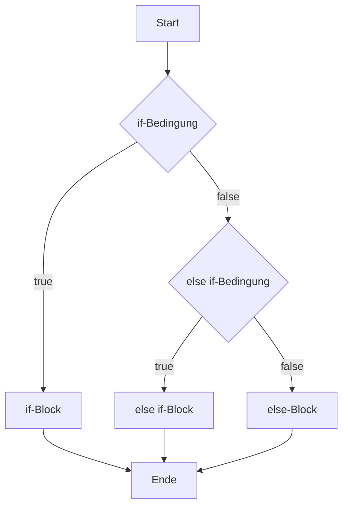

import { Callout } from 'nextra/components'

# Verzweigungen mit `if`, `else if` und `else`

<Callout>
  **Dauer:** 30 Minuten

  **Ziel:** Kontrollfluss eines Programms steuern
</Callout>

Bisher haben wir nur Sequenzen von relativ 
einfachen Anweisungen betrachtet.

Für komplexere Algorithmen werden Konstrukte 
benötigt, die den Ablauf eines Programms steuern 
können.

Mit Verzweigungen lässt sich die
Abarbeitungsreihenfolge bzw. der Kontrollfluss 
eines Programms ändern. 


Bildquelle: https://flic.kr/p/5kZ54J

Der Aufbau bzw. die Syntax einer Verzweigung
mit `if/else if/else` hat folgendes Schema 
(„Pseudocode“):

```
if( ...ein logischer Ausdruck X vom Typ boolean... ) {
  // Anweisungen in diesem Block werden ausgeführt,
  // wenn X wahr (true) ist
} else if( ...ein logischer Ausdruck Y vom Typ boolean... ) {
  // Anweisungen in diesem Block werden ausgeführt,	
  // wenn X falsch (false) und Y wahr (true) ist
} else if( ...ein logischer Ausdruck Z vom Typ boolean... ) {
  // Anweisungen in diesem Block werden ausgeführt,
  // wenn X und Y falsch (false) sind und Z wahr (true) ist
	
  // hier könnten noch mehrere else if Blöcke folgen
} else {
  // Anweisungen in diesem Block werden ausgeführt, wenn alle
  // Bedingungen in den if und else if Blöcken falsch (false) sind
}
```



**Bemerkungen**:

- Die logischen Ausdrücke werden manchmal auch Bedingungen genannt.
- Die Bedingungen müssen lediglich einen Wert vom Typ `boolean` ergeben (also `true` oder `false`).
- Es muss genau einen `if`-Block geben.
- Es können beliebig viele `else if`-Blöcke angegeben werden (oder auch keine).
- Es kann höchstens einen `else`-Block geben (oder auch keinen). 

<Callout type="info">
In JavaScript werden Bedingungen auch mit sogenannten **truthy/falsy**
Werten ausgewertet. „Falsy“ sind z. B. `false`, `0`, `""`, `null`,
`undefined` und `NaN`. Fast alles andere ist „truthy“.

Für den Einstieg ist es oft besser, Bedingungen **explizit** zu formulieren,
z. B. `if (name !== "")` statt nur `if (name)`.
</Callout>

Ein Beispiel dazu:

```js
import { questionInt } from "readline-sync";

const i = questionInt("Bitte Zahl eingeben");

if(i >= 0) {	
  console.log(`${i} ist nicht negativ`);
} else {	
  console.log(`${i} ist negativ`);	
}
```

Hier haben wir ein `if` und dann direkt ein `else`.
Keine weiteren Fälle werden mit `else if`
unterschieden. Dies ist also sozusagen ein 
„entweder ... oder“. 

Ein weiteres Beispiel:

```js
import { questionInt } from "readline-sync";

const i = questionInt("Bitte Zahl eingeben");
	
if(isNaN(i)) {	
  console.log("Bitte eine Zahl eingeben, d.h. nur Ziffern eintippen!");	
} else if(i >= 0) {
  console.log(`${i} ist nicht negativ`);
} else {	
  console.log(`${i} ist negativ`);
}
```

Hier haben wir einen weiteren Fall hinzugefügt, 
sodass wir nun drei Fälle unterscheiden. Das erste 
`if` überprüft, ob eine gültige Zahl eingegeben wurde.
Mit `isNaN()` hat JavaScript eine Hilfsfunktion, 
die `true` genau dann zurückliefert, wenn der 
übergebene Parameter `NaN` ist, und ansonsten `false`
ergibt. 

<Callout type="info" emoji="👨🏻‍💻">
In der gemeinsam entwickelten Wetter-App bauen
wir passende `if`-Verzweigungen ein, z. B. für den 
Test auf gültige Zahleingabe mit `parseInt()` und 
`isNaN()` wie oben gezeigt.
</Callout>

Besteht ein Anweisungsblock bei einem 
`if/else if/else` aus nur einer Zeile, dann 
können die geschweiften Klammern weggelassen 
werden:

```js
import { questionInt } from "readline-sync";

const i = questionInt("Bitte Zahl eingeben");
	
if(isNaN(i))
  console.log("Bitte eine Zahl eingeben, d.h. nur Ziffern eintippen!");	
else if(i >= 0)
  console.log(`${i} ist nicht negativ`);
else 
  console.log(`${i} ist negativ`);
```

Es schadet nicht, auch hier Klammern zu verwenden, 
da oft später weitere Zeilen hinzukommen. Außerdem 
erreicht man so einen konsistenten Programmierstil.

**Programmieren ~ „Konzepte kombinieren“**

 Im Block einer Verzweigung 
 (`if` … `else if` … `else` …) können 
 wiederum weitere Verzweigungen vorkommen.

Die verschiedenen Konstruktionen lassen sich „schachteln“:

- Kombination verschiedener Ausdrücke mit Operatoren zu neuen Ausdrücken
- Schleifen (`while`/`for`) in Schleifen oder Verzweigungen
- Funktionsaufrufe als Ausdrücke in den Bedingungen
- Funktionsaufrufe in den `if/else if/else`-Blöcken
- Funktionen, die in Funktionen deklariert werden.
- viele Möglichkeiten, die in Code oft genutzt werden …!
