import { Callout } from 'nextra/components'

# Fallunterscheidungen (switch)

<Callout>
  **Dauer:** 30 Minuten

  - `switch` als Alternative zu `if/else if/else`

  **Ziel:** Es gibt oft mehrere Konzepte der Programmierung, die für eine Lösung geeignet sind
</Callout>

Es gibt Situationen, in denen mehrere Fälle unterschieden werden 
müssen. Mit `if … else if … else …` kann dies recht 
unübersichtlich werden:

```js
import { question } from "readline-sync";

let a = 13, b = 4;	
let op = question("Welche Rechenoperation?");
if(op === "+") {
  console.log(a + b);
} else if(op === "-") {
  console.log(a - b);
} else if(op === "*") {
  console.log(a * b);
} else if(op === "/") {
  console.log(a / b);
} else if(op === "%") {
  console.log(a % b);
} else {
  console.log(`Operator ${op} nicht unterstützt`);
}
```

In solchen Situationen stellt `switch` gelegentlich eine besser 
lesbare Alternative dar:

```javascript
import { question } from "readline-sync";

let a = 13, b = 4;	
let op = question("Welche Rechenoperation?");
switch(op) {
  case "+":
    console.log(a + b);
    break;
  case "-":
    console.log(a - b);
    break;
  case "*":
    console.log(a * b);
    break;
  case "/":
    console.log(a / b);
    break;
  case "%":
    console.log(a % b);
    break;
  default:
    console.log(`Operator ${op} nicht unterstützt`);
}
```




```mermaid
flowchart TD
  A[Start] --> B["op = question('Welche Rechenoperation?')"]
  B --> C{{op}}
  C -->|\+| D["console.log(a + b)"]
  D --> E[End]
  C -->|\-| F["console.log(a - b)"]
  F --> E
  C -->|\*| G["console.log(a * b)"]
  G --> E
  C -->|/| H["console.log(a / b)"]
  H --> E
  C -->|%| I["console.log(a % b)"]
  I --> E
  C -->|default| J["console.log('Operator ' + op + ' nicht unterstützt')"]
  J --> E
  linkStyle default font-size:24px
```

Der Code ist insgesamt etwa gleich lang und ergibt hier in 
beiden Beispielen dasselbe Ergebnis. Dennoch finden manche,
dass `switch` oft klarer strukturiert ist als verschachtelte
`if/else if/else`-Ausdrücke. Dadurch entsteht durch `switch`
gelegentlich Code, der einfacher zu lesen ist als ein Ansatz
mit `if/else if/else`. 

<Callout type="info">
**Bemerkungen**

Grundsätzlich lassen sich alle Verzweigungen und 
Fallunterscheidungen mit `if/else if/else` ausdrücken. 
`switch` stellt lediglich eine Alternative dar, die in
manchen Situationen nützlich sein kann.

`switch` gibt es in einigen Programmiersprachen.

Mit `switch` sehen wir ein Beispiel dafür, dass es in
Programmiersprachen oftmals mehrere Möglichkeiten gibt,
etwas in Code auszudrücken.
</Callout>


Die Syntax eines `switch`-Ausdrucks sieht im Allgemeinen so aus:

```javascript
switch( ...Auswahlausdruck... ) {
  case Auswahlkonstante:
    // Anweisung
    // ⋮
    // Anweisung
    break;
  case Auswahlkonstante:
    // Anweisung
    // ⋮
    // Anweisung
    break;
  // ⋮
  default:
    // Anweisung
    // ⋮
    // Anweisung
    break;
}
```

Der `Auswahlausdruck` zu Beginn des `switch` wird oft durch 
den Inhalt einer Variablen vorgegeben.

Für die `Auswahlkonstanten` in den `case`-Teilen 
wird dann ein konkreter Wert für die im `switch`
angegebene Variable abgefragt. Hier wird ein Test 
auf Gleichheit durchgeführt, allerdings ohne den 
Vergleich hinzuschreiben.

Der `Auswahlausdruck` wird ausgewertet, sein Wert 
wird unter den vorhandenen `Auswahlkonstanten`
gesucht. Die Anweisungen unmittelbar nach der 
entsprechenden Auswahlkonstante werden bis zum 
nächsten `break` ausgeführt.

Die Anweisungen werden fortlaufend ausgewertet 
(„_fall-through_")!
    
Daher Vorsicht: `break` nicht vergessen!

Es können ein oder mehrere `case`-Blöcke angegeben 
werden. Es kann höchstens einen `default` Block 
geben (analog zu else in Verzweigungen), der aktiv
wird, wenn keine der `Auswahlkonstanten` dem
`Auswahlausdruck` gleicht.

Ein `switch` funktioniert nur in bestimmten 
Situationen, nämlich wenn für einen Ausdruck bzw.
eine Variable nur die Gleichheit überprüft wird.

<Callout type="info">
Wir zeigen Beispiele, damit `switch`
in verschiedenen Situationen nachvollzogen werden 
kann (`case` zusammenfassen, `break`, 
„_fall-through_“, usw.).
</Callout>

<Callout type="info" emoji="👨🏻‍💻">
In die Wetter-App könnten wir ein Hauptmenü einbauen:

- Überschrift und Menüpunkte (1: Ort eingeben, 2: Alle Orte anzeigen, 3: Beenden) mit Template-String
- `switch` für die Auswahl der Menüpunkte
- für Option 1 und 2 wird jeweils eine passende Funktion aufgerufen
- Option 1 `weatherByLocation()` mit bisherigem Code
- Option 2: `showLocations()` mit `console.log("noch nicht implementiert")`; o.ä.
- Option 3 beendet die App mit `process.exit()`

Mit `console.clear();` Bildschirm löschen. 

`question('weiter mit Enter');` um kurz zu warten.
</Callout>

## `switch` als Alternative zu `if/else if/else`

Jede Verzweigung mit `if` kann im Prinzip durch
ein `switch` ersetzt werden. Dazu kann zunächst
ein `switch` mit dem „Auswahlausdruck“ `true`
deklariert werden:

```js
switch(true) {
  // case...usw.
}
```

Nun lassen sich in den `case`-Teilen beliebige
logische bzw. boolesche Ausdrücke verwenden:

```js
import { questionInt } from "readline-sync";

const age = questionInt("Bitte Alter eingeben:");

switch(true) {
  case age > 0 && age < 18:
    console.log("minderjährig");
    break;
  case age >= 18 && age < 67:
    console.log("erwachsen");
    break;
  case age >= 67 && age < 120:
    console.log("im Ruhestand");
    break;
  default:
    console.log("Ungültiges Alter: " + age);
    break;
}
```

Hier wird sozusagen jeder `case`-Ausdruck mit `true`
verglichen, sodass hierdurch beliebige Verzweigungen
(`if/else if/else`) auch mit `switch` 
ausgedrückt werden können.
