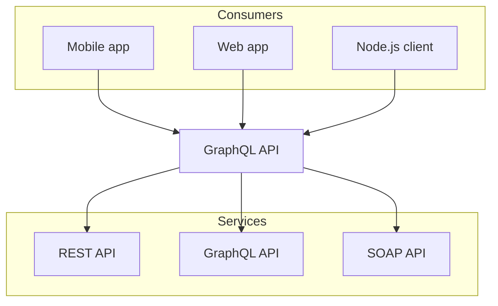

import { Callout } from 'nextra-theme-docs'

# Ablauf

<Callout>
  **Dauer:** 15 Minuten

  - Lernziel
  - Aufbau und Format der Vorlesung
  - Übersicht der Inhalte

  **Ziel:** Orientierung für diese Vorlesung
</Callout>

Für diese Veranstaltung gibt es 96 Vorlesungsstunden mit jeweils 45 Minuten.

<Callout type="info">
Zusätzlich ist es möglich, diese Vorlesung mit 24 Stunden begleitetem 
Selbststudium zu ergänzen. Dabei könnten Übungen, Vertiefungen und 
Themen wie Versionskontrolle mit _git_ behandelt werden &mdash; oder 
diese Zeit wird für das Programmierprojekt eingeplant.

Die Termine für das „Begleitete Selbststudium“ sind als solche im 
Kurskalender bezeichnet (siehe Kalender im Browser oder in der 
Campus App). Begleitetes Selbststudium findet ohne Anwesenheitspflicht statt. 
Der Dozent steht bei diesen Terminen online via BBB zur Verfügung.
</Callout>

## Veranstaltung mit zwei Teilen

Die Vorlesung besteht aus zwei Teilen:

**Teil 1:** Grundlagen der imperativen und prozeduralen Programmierung, Übungen zur Vertiefung (ca. 1/3 der Zeit)

**Teil 2:** Ausgewählte weiterführende Konzepte (z.B. Objektorientierung), Programmierprojekt (ca. 2/3 der Zeit) 

- Wenn die Entwicklung der Projekte in den Teams beginnt, dann ändern wir das Format der Vorlesung:   &xrarr; Zeit zum Programmieren und für Fragen und Feedback
- Bei online-Terminen treffen wir uns zunächst immer in der Videokonferenz &mdash; auch wenn bei späteren Terminen die Zeit hauptsächlich zum Programmieren genutzt wird.

## Programmieren lernen und vertiefen

Die Vorlesung setzt zwar keine Vorkenntnisse voraus, jedoch werden wir die aufeinander aufbauenden Themen in relativ kurzer Zeit behandelt.

 

<mark>Das eigentliche Ziel ist, Programmierprojekte im Team umsetzen zu können.</mark>

Es kann sehr demotivierend sein, wenn wir programmieren wollen und dabei mit nicht genügend gefestigten Grundlagen „kämpfen“ müssen.

Wir wollen also zunächst die Grundlagen aus Teil 1 so gut wie möglich festigen.

Dafür sind insbesondere die Übungsaufgaben und das Selbststudium wichtig.

## Format der Vorlesung

In der gemeinsamen „Vorlesung“ wird hauptsächlich **aktives** Lernen
durch Live Coding stattfinden. Die Studierenden können die Konzepte
mitprogrammieren und interaktiv Fragen stellen. **Daher sollten 
alle bitte immer ihren Laptop mitbringen.** Folien wird es kaum 
geben, da diese nur ein **passives** Lernen ermöglichen. 

Durch praktische Übungen und insbesondere das Gruppenprojekt 
werden die Inhalte angewendet und vertieft. 

In Moodle wird Material zum Nachschlagen bereitgestellt. Eigene 
Recherchen im Selbststudium sind während des Projekts 
unumgänglich und verstärken das aktive Lernen. 

Dozierende bieten Hilfestellung und Coaching während des Projekts an. 
Wir werden während der späteren Termine auch Zeit für das gemeinsame
Programmieren haben.

### Ablauf einer Lerneinheit

Eine Lerneinheit besteht in der Regel aus Live Coding 
zum Mitmachen mit anschließenden Aufgaben zur Übung:

1. Kurze Vorstellung eines Themas im Kurs mit Live Coding
1. Kleine Aufgaben dazu bearbeiten
1. Dozent kann dabei helfen (bei online-Terminen in „Gruppenräumen“ bzw. „Breakout-Rooms“).
1. Abschließende Besprechung der Lösung und Übergang zum nächsten Thema

**Wichtige Bemerkung:** Die Studierenden sollten jede Übung
eigenständig lösen können. Falls dies nicht der Fall sein sollte,
dann ist <mark>**unbedingt** Nacharbeiten im Selbststudium nötig</mark>. 
Fast jedes Thema baut auf den zuvor vermittelten Inhalten auf,
sodass diese möglichst vollständig beherrscht werden sollten, damit neue Inhalte verstanden werden (_mastery based learning_).

<Callout type="info">
&xrarr; Notizen und Links zum Nachschlagen finden sich auf dieser „Workshops“-Webseite. Zu jedem Thema gibt es in Moodle passende Links auf diese Webseite.

Für die Vorlesung stellt diese Webseite ein „lebendes Skript“ dar, weil hier
im Verlauf der Veranstaltungen Anpassungen vorgenommen werden und 
Ergänzungen hinzukommen können.
</Callout>

## Online Live Coding

Oft werden Erklärungen in Form von „Live Coding“ vorgeführt, die 
parallel auf dem eigenen Rechner direkt nachvollzogen werden 
können.

Das „Mitprogrammieren” ist einfacher, wenn beim Live Coding nicht 
ständig zwischen verschiedenen Programmfenstern hin- und 
hergewechselt werden muss.

Dies kann auf verschiedene Weisen erreicht werden:

- Zwei Displays (Laptop, Monitor, Tablet), sodass ein Display das Live Coding im Browser zeigt und auf dem anderen programmiert wird.
- Zwei Fenster nebeneinander auf einem großen Monitor: Browser mit Live Coding neben der Programmierumgebung.
- _Picture-in-picture_ (Bild-im-Bild) zeigt Live-Coding als „schwebendes“ Fenster, wodurch zu anderen Browser-Tabs bzw. zum Editor gewechselt werden kann.

### Bild-im-Bild (Picture-in-picture)

Eine „Bild-im-Bild“-Funktion wird von allen modernen Browsern 
für Videos unterstützt.

Wechsel zu anderen Tabs im Browser wird somit möglich während das „schwebende“ Fenster stets angezeigt wird.

Das „schwebende“ Fenster mit dem Live-Coding kann evtl. auch über anderen Editoren wie VS Code, IntelliJ, PyCharm, Android Studio, usw. dargestellt werden.

Im „schwebenden“ Fenster ist ein Knopf, mit dem das Fenster wieder im ursprünglichen Browser-Tab „angedockt“ werden kann. 

<Callout type="warning" emoji="👨🏻‍💻">
Kurze Vorführung der „Bild-im-Bild“-Funktion.
</Callout>

<Callout>
Spätestens jetzt 15 Minuten Pause.
</Callout>
