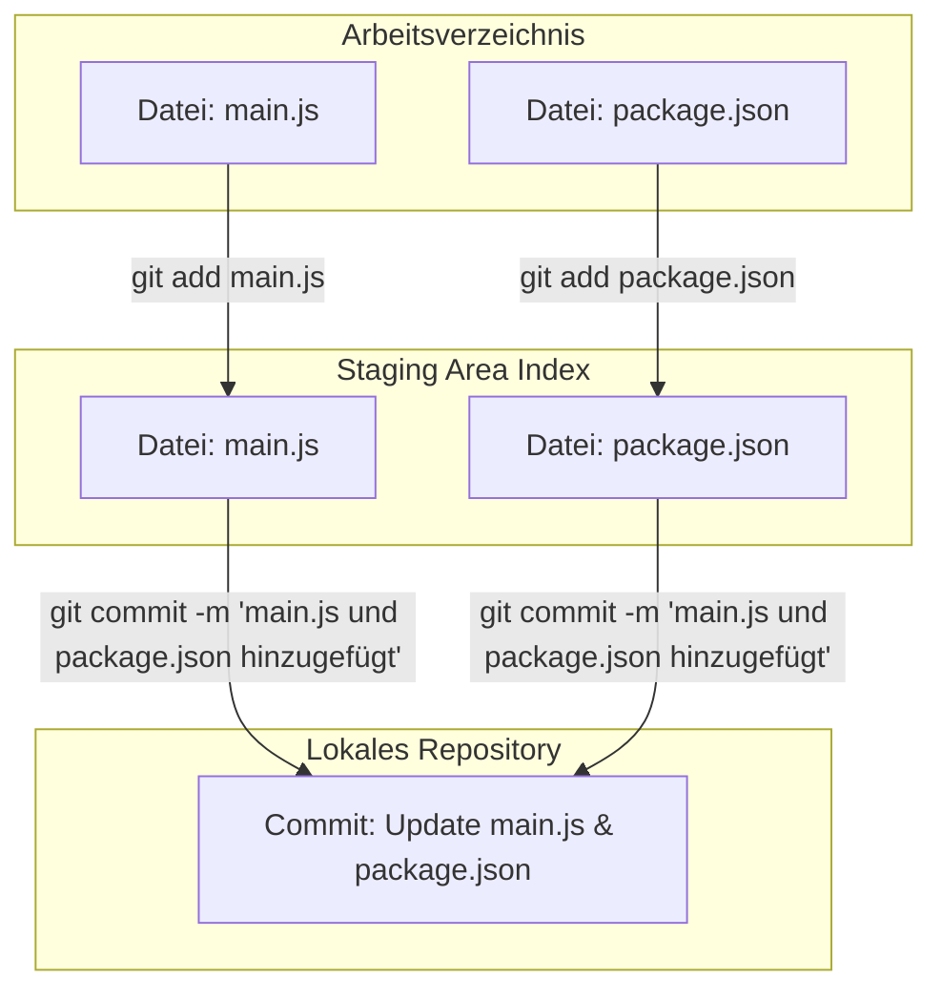

import { Callout } from 'nextra/components'

# Mit Git arbeiten

Nun werden wir gemeinsam die wichtigsten Schritte für die 
tägliche Arbeit im Team mit Git und GitHub durchgehen.

Folgende Git-Befehle werden wir kennenlernen:

- `git status` (Status der Dateien anzeigen)
- `git diff` (Unterschiede anzeigen)
- `git add` (Dateien hinzufügen)
- `git commit` (Änderungen bestätigen)
- `git pull` (Änderungen vom Server holen)
- `git push` (Änderungen auf den Server laden)
- `git log` (Änderungshistorie anzeigen)

&rarr; Wir werden diese Befehle sowohl im Terminal als auch 
mit den Git-Tools in VS Code ausführen.

## Lokale Änderungen an Dateien

Das lokale Repository auf dem eigenen Rechner ist eine 
Kopie des Repository auf GitHub. Hier können wir Änderungen
daher an Dateien lokal vornehmen, d.h. andere Teammitglieder
sehen diese Änderungen noch nicht. Änderungen können sein:

- Hinzufügen neuer Dateien
- Ändern bestehender Dateien
- Löschen von Dateien

In unserem Repository haben wir bereits ein paar Dateien:

- `README.md` (Text-Datei mit Informationen zum Projekt in [Markdown](https://docs.github.com/de/github/writing-on-github/basic-writing-and-formatting-syntax))
- `.gitignore` (Liste von Dateien, die von Git ignoriert werden sollen, z.B. alles in `node_modules`)
- Vielleicht auch die `LICENSE`-Datei (Lizenz für das Projekt)

## Repository-Zustand mit `git status` überprüfen

<Callout type="error" emoji="🚨">
Wenn Sie die folgenden Schritte mitmachen möchten,
dann sollte dies pro Team nur eine Person tun, um
mögliche Konflikte in den Änderungen zunächst zu vermeiden.

Vielleicht ist es sinnvoll, dass die Person im Team,
die sich noch nicht so gut mit Git auskennt, die
Schritte durchführt, um die Abläufe besser zu verstehen.

Achten Sie auch darauf, ob die Änderungen im aktuellen
Stand Ihres Projekts sinnvoll sind und ob Sie evtl. andere
Dateien bzw. Änderungen vornehmen möchten. Es ist auch 
möglich, die Änderungen später wieder rückgängig zu machen.
</Callout>

Wir erstellen in VS Code eine neue Datei `main.js` im 
Projektordner und fügen folgenden Code ein (gerne 
anpassen):

```js
console.log("Willkommen im Programm!");
```

Dadurch haben wir eine neue Datei erstellt, die noch
nicht im Git-Repository erfasst ist. Dies ist durch
den Status `untracked` gekennzeichnet und wird durch 
grüne Färbung des Dateinamens mit Zusatz `U` im 
Explorer von VS Code dargestellt (es gibt auch `D` in 
rot für `deleted` und `M` in gelb für `modified`). 

Wir können den Status der Dateien in VS Code im Bereich 
`Source Control` überprüfen. Außerdem gibt es dafür 
ein eigenes Terminal-Kommando:

```bash
git status
```

<Callout>
Mit `git status` im Terminal oder den Git-Tools in VS Code 
können wir den Status der Dateien jederzeit überprüfen und 
sehen, welche Dateien neu sind, geändert wurden oder 
gelöscht wurden.
</Callout>

## Änderungen mit `git diff` anzeigen

Während uns `git status` den Status der Dateien anzeigt,
können wir mit `git diff` die genauen Änderungen in den
Dateien anzeigen. Dazu geben wir im Terminal folgenden
Befehl ein:

```bash
git diff
```

Dies zeigt uns die Unterschiede der aktuellen Änderungen
im lokalen Repository an. Es ist auch möglich, nur die
Änderungen einer bestimmten Datei anzuzeigen:

```bash
git diff main.js
```

Da `main.js` eine neue Datei ist, wird der gesamte Inhalt
der Datei angezeigt. Bei geänderten Dateien werden nur die
geänderten Zeilen angezeigt.

In VS Code können wir die Änderungen auch direkt im
`Source Control`-Bereich sehen, indem wir dort eine 
Datei auswählen und die Änderungen anzeigen lassen.

## Änderungen mit `git add` hinzufügen

Wenn wir unsere Änderung bestätigen wollen, müssen wir
in Git in zwei Schritten vorgehen:

1. Änderungen hinzufügen (`git add`)
2. Änderungen bestätigen (`git commit`)

Zunächst müssen wir die Dateien hinzufügen, die wir 
für die Änderung bestätigen wollen. Dazu verwenden wir den
Befehl `git add`. Wir können einzelne Dateien oder 
auch alle geänderten Dateien hinzufügen. Im Terminal geben 
wir folgenden Befehl für das Hinzufügen von `main.js` ein:

```bash
git add main.js
```

Damit wird die Datei `main.js` für die nächste bestätigte
Änderung (`commit`) vorgemerkt. Wir können auch alle 
geänderten Dateien hinzufügen (der Punkt `.` steht für 
das aktuelle Verzeichnis):

```bash
git add .
```

Damit haben wir die Datei `main.js` für die nächste
Änderung vorgemerkt. Der Status der Dateien hat sich
nun geändert und wir können dies mit `git status`
überprüfen.

Auch in VS Code lässt sich dies im `Source Control`-Bereich 
nachvollziehen. Dort sehen wir die vorgemerkten Dateien
unter `Staged Changes` und können sie auch einzeln oder
alle auf einmal hinzufügen.

<Callout>
Auch wenn wir später vielleicht hauptsächlich die 
Git-Tools in VS Code verwenden, ist es wichtig, die
Grundlagen der Git-Befehle zu kennen, um zu verstehen,
was im Hintergrund passiert. 
</Callout>

## Änderungen mit `git commit` bestätigen

<Callout>
Erinnerung: Bevor wir Änderungen bestätigen, sollten wir
sicherstellen, dass wir die Änderungen mit `git status`
und `git diff` überprüft haben und die richtigen Dateien 
mit `git add` hinzugefügt haben.
</Callout>

Nachdem wir die Änderungen hinzugefügt haben, können wir
sie mit `git commit` bestätigen. Dazu geben wir im Terminal
folgenden Befehl ein:

```bash 
git commit -m 'main.js hinzugefügt'
```

Mit `-m` geben wir eine Nachricht an, die die Änderung
beschreibt. Diese Nachricht ist wichtig, um später 
nachvollziehen, was in einem `commit` geändert wurde.

Nach dem Bestätigen der Änderung mit `git commit` ist
die Änderung im lokalen Repository festgehalten. Wir
können dies mit `git status` überprüfen und sehen, dass
es keine Änderungen mehr gibt. Ebenso sind in VS Code
die vorgemerkten Dateien aus dem `Source Control`-Bereich
verschwunden.

## Änderungen in VS Code bestätigen

Nun wollen wir zunächst das Projekt mit `package.json`
erweitern. Dazu führen wir im Terminal folgenden Befehl aus:

```bash
npm init 
```

Im Dialog geben wir die gewünschten Informationen ein, die
meisten können wir mit Enter bestätigen. Am Ende wird eine
`package.json`-Datei erstellt. 

Wir spielen diese Änderung nun komplett in VS Code durch:

- Status im `Source Control`-Bereich überprüfen
- Datei `package.json` hinzufügen (mit `+`-Zeichen)
- Datei `package.json` ist nun in `Staged Changes`
- Commit-Nachricht eingeben (z.B. _package.json hinzugefügt_) 
- `Commit`-Button klicken 

## package.json mit prompt-sync

`.gitignore` enthält bereits den Eintrag `node_modules`,

## Änderungen rückgängig machen

## Änderungen werden in `commits` festgehalten

In Git ist ein `commit` eine Bestätigung von Änderungen 
an beliebig vielen Dateien. Dies können neue Dateien sein,
geänderte Dateien oder gelöschte Dateien. Ein `commit` wirkt
sich auf die gesamte Arbeitskopie aus, d.h. alle Dateien
werden in den Zustand des `commit` zurückgesetzt.


## Staging Area




## Änderungen auf GitHub für das Team bereitstellen

## Abschließende Bemerkungen

Wir haben nur die wichtigsten Befehle im Umgang mit Git 
und GitHub kennengelernt, um gemeinsam an einem Projekt
zu arbeiten. Es gibt viele weitere Befehle und 
Möglichkeiten, Git und GitHub zu nutzen. Mehr Infos 
zu Git:

- Dokumentation bei GitHub: https://docs.github.com/de/get-started/start-your-journey/git-and-github-learning-resources
- Online-Buch "Pro Git": https://git-scm.com/book/de/v2
- Git-Tutorial (Video, 40 min): https://www.youtube.com/watch?v=uGLQF2kUwOA&t
- ChatGPT und andere KI-Chats können Git erklären und insbesondere Fragen in bestimmten Situationen beantworten.


<Callout>
Es gib viele Tools für die Arbeit mit Git und GitHub, z.B.
bietet GitHub auch einen [Desktop-Client](https://desktop.github.com/) an. Manche
</Callout>