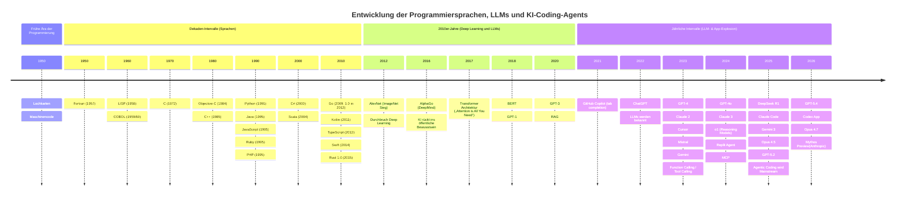

```mermaid
timeline
    title Entwicklung der Programmiersprachen, LLMs und KI-Coding-Agents
    section Frühe Ära der Programmierung
        1950 : Lochkarten : Maschinencode
    section Dekaden-Intervalle (Sprachen)
        1950 : Fortran (1957)
        1960 : LISP (1958) : COBOL (1959/60) 
        1970 : C (1972)
        1980 : Objective-C (1984) : C++ (1985)
        1990 : Python (1991) : Java (1995) : JavaScript (1995) : Ruby (1995) : PHP (1995)
        2000 : C# (2000) : Scala (2004)
        2010 : Go (2009; 1.0 in 2012) : Kotlin (2011) : TypeScript (2012) : Swift (2014) : Rust 1.0 (2015)
    section 2010er-Jahre (Deep Learning und LLMs)
        2012 : AlexNet (ImageNet Sieg): Durchbruch Deep Learning
        2016 : AlphaGo (DeepMind) : KI rückt ins öffentliche Bewusstsein
        2017 : Transformer Architektur („Attention is All You Need“)
        2018 : BERT : GPT-1
        2020 : GPT-3 : RAG
    section Jährliche Intervalle (LLM- & App-Explosion)
        2021 : GitHub Copilot (tab completion)
        2022 : ChatGPT : LLMs werden bekannt
        2023 : GPT-4 : Claude 2 : Cursor : Mistral : Gemini : Function Calling / Tool Calling
        2024 : GPT-4o : Claude 3 : o1 (Reasoning Models) : Replit Agent : MCP
        2025 : DeepSeek R1 : Claude Code : Gemini 3 : Opus 4.5 : GPT-5.2 : Agentic Coding wird Mainstream
        2026 : GPT-5.4 : Codex App : Opus 4.7 : Mythos Preview(Anthropic)
```